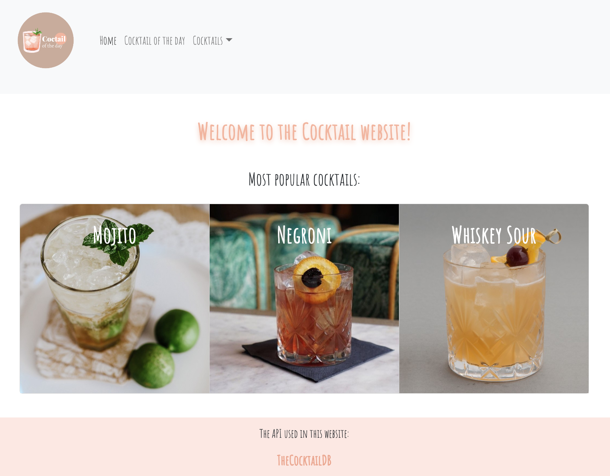
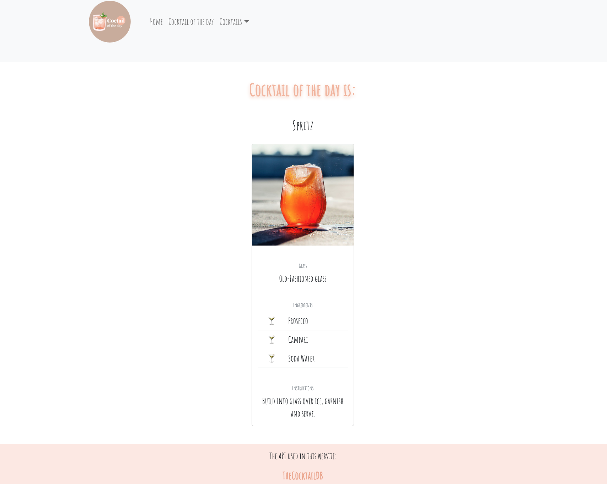
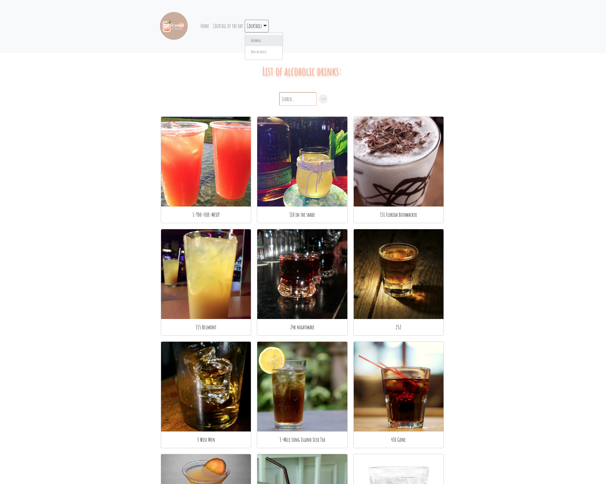
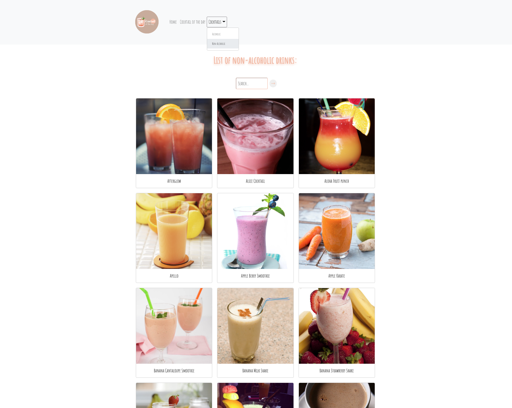
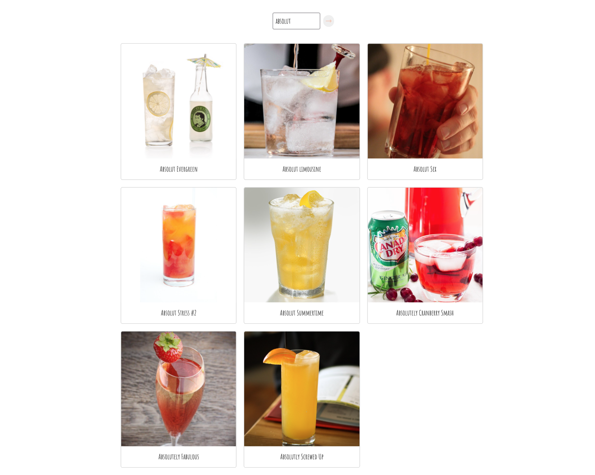

# Cocktail of the day

Course: Web Development Frameworks

DIN21SP

Simple website that retrieves data from API.

- React
- React Bootstrap
- Axios

API used: https://www.thecocktaildb.com/api.php

> API Methods are using the developer test key '1' as the API key.

&nbsp;

## Functionality of the website:

### Home page
Cocktail information presented on the home page is retrieved from the API by using the Axios library.

&nbsp;

### Cocktail of the day
A random cocktail is displayed by using the API service that looks up a random cocktail. A new cocktail is retrieved every time this page is opened.

&nbsp;

### Cocktails dropdown menu: Alcoholic
A list of alcoholic drinks is retrieved from the API when this page is opened. A search of the presented alcoholic drinks can be done on this page. On change of the search input, the list of the drinks that match the input is presented.

&nbsp;

### Cocktails dropdown menu: Non-Alcoholic
A list of non-alcoholic drinks is retrieved from the API when this page is opened. A search of the presented alcoholic drinks can be done on this page. On change of the search input, the list of the drinks that match the input is presented.

&nbsp;

### Example search:
A list of alcoholic drinks that contain word 'absolut' in their name is displayed. **Don't include capital letters in your search input!**

